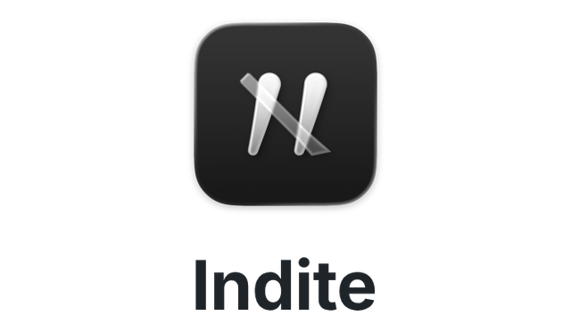
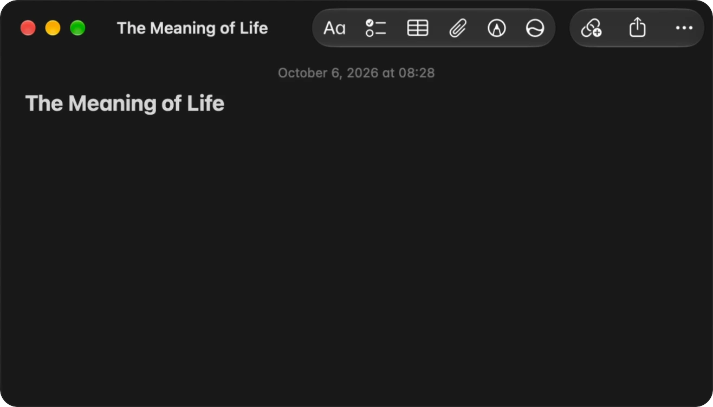
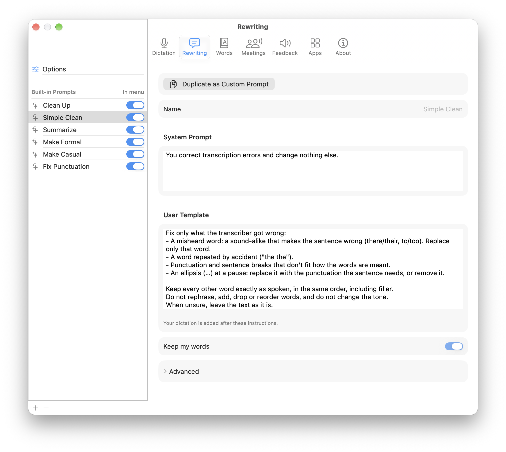
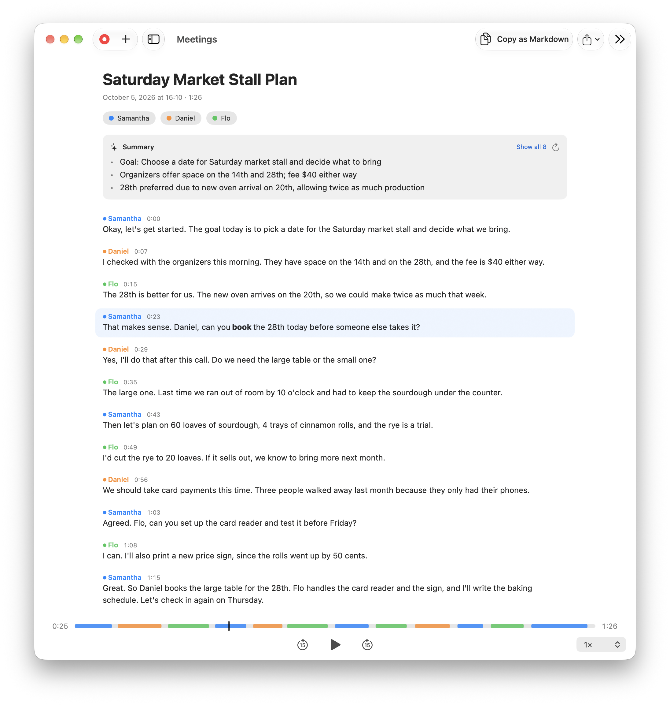
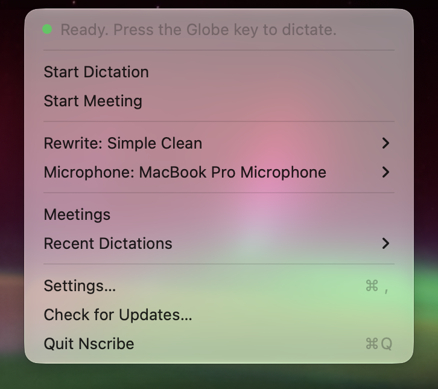

<p align="center">
  <picture>
    <source media="(prefers-color-scheme: dark)" srcset="Docs/Images/wordmark-dark.png">
    
  </picture>
</p>

<h3 align="center">Unlock the potential of Apple's Foundation Models.</h3>

<p align="center">Fast, free, on-device dictation and transcription that knows your context and adapts to your prompts.</p>

<br>

<p align="center">
  <a href="https://github.com/frozenemitt/nscribe/releases/latest/download/Nscribe.dmg">
    <picture>
      <source media="(prefers-color-scheme: dark)" srcset="Docs/Images/download-dark.png">
      
    </picture>
  </a>
  <br>
  <sub>Open source · macOS 27 · English</sub>
</p>

<br>

<p align="center">
  
</p>

Speak into any app on your Mac, and get every meeting transcribed. Nscribe runs on
Apple's speech recognition and Foundation Models, the models behind Apple
Intelligence, entirely on your device.

## Dictation

Reply quickly, to people or to software.

Teach Nscribe a few words of your own, and it also picks up the names and unusual
words in the window you're dictating into, so they come out spelled right.

Choose how your words come out: formal in Mail, casual in Messages, a style for every
app. Each style is a plain-English prompt, so edit any of them or write your own. Let
rewriting read what's already in the text field, and your answer fits the thread.

<p align="center">
  <picture>
    <source media="(prefers-color-scheme: dark)" srcset="Docs/Images/rewriting-dark.png">
    
  </picture>
</p>

## Meetings

Stay in the conversation and let Nscribe take the notes. It records your microphone
and, if you allow it, the sound your Mac plays, so it hears both sides of a call in
any app. Nobody else has to install anything.

When the meeting ends, see who said what, with a title and a summary on top. Play the
recording and follow each word as it's spoken, fix what it misheard, and export the
transcript as Markdown to ask an AI what was decided. Transcribe recordings and videos
you already have, too.

<p align="center">
  <picture>
    <source media="(prefers-color-scheme: dark)" srcset="Docs/Images/meeting-window-dark.png">
    
  </picture>
</p>

## Privacy

Your audio and text never leave your device. To spell names right, Nscribe reads the
text of the window you're dictating into, and keeps only the unusual words for that
one dictation. Store your latest dictations and your meeting recordings on your Mac,
and delete them at any time. Or choose to not store them at all.

Nscribe connects to the internet for three things only:

- Apple's English speech recognition, which macOS downloads the first time you
  dictate.
- A daily check for a new version of Nscribe, which you can turn off. Each update is
  checked against Nscribe's own signature before it installs.
- The files that tell voices apart, downloaded from Hugging Face when you install
  them for meetings.

## Install

Nscribe needs macOS 27 and dictates in English. Rewriting and meeting summaries need
Apple Intelligence turned on.

1. Download [Nscribe](https://github.com/frozenemitt/nscribe/releases/latest/download/Nscribe.dmg)
   and drag it into Applications.
2. Open it. The first time, macOS warns that it can't check Nscribe for malware. Apple
   checks only apps from its paid developer program, and Nscribe, a free project,
   isn't in it. Click **Done**, then open **System Settings → Privacy & Security** and
   click **Open Anyway**.
3. Nscribe opens in the menu bar, and its welcome window sets up the permissions with
   you.

<p align="center">
  
</p>

## FAQ

**Which key starts dictation?**
The Globe key (🌐) by default. You can change it to any key combination in Nscribe's
settings.

**Pressing Globe opens the emoji picker.**
macOS uses the Globe key too. In System Settings → Keyboard, set "Press 🌐 key to" to *Do Nothing*.
The emoji picker is still on Control-Command-Space (⌃⌘Space), Apple's own default.

**What permissions does it need?**

| Permission | What for |
|---|---|
| Microphone | Hearing you |
| Speech Recognition | Turning speech into text |
| Accessibility | Typing into other apps, and reading the window you dictate into. macOS files both under Accessibility. |
| Screen & System Audio Recording | Hearing the other side of a call, if you turn that on. Nscribe takes only the sound. |

**Why isn't it on the Mac App Store?**
App Store apps have to be sandboxed, and a sandboxed app can't type into other apps.

## Build from source

For developers: you need Xcode 27 and a free Apple ID.

```bash
git clone https://github.com/frozenemitt/nscribe.git
cd nscribe
Scripts/install.sh
```

See [BUILDING.md](BUILDING.md) for Xcode builds, releases and the code layout.

## License

[MIT License](LICENSE).

## Acknowledgments

Built on [Swift Scribe](https://github.com/seamlesscompute/swift-scribe) by
seamlesscompute (MIT). The dictation and meeting features are modeled on
[voxtype](https://github.com/peteonrails/voxtype). Speaker separation uses
[FluidAudio](https://github.com/FluidInference/FluidAudio), and updates use
[Sparkle](https://sparkle-project.org).
